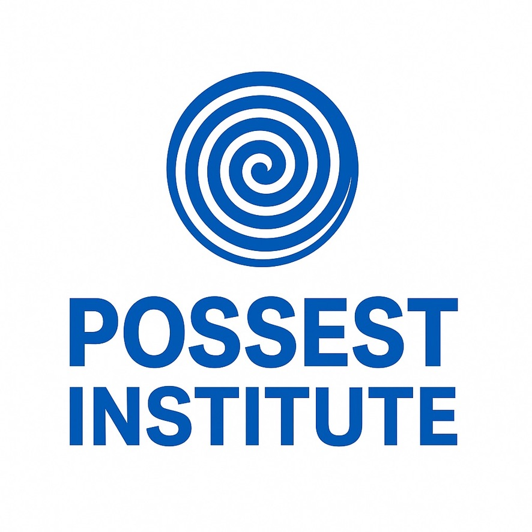

  

# Possest Institute (PQF)

This is a living repository of bifurcational topology, parrhesiastic singularity, and non-formal knowledge access.

## Filters

- **Swamp** — pre-formal affective states
- **Manifest** — declarations that destabilize form
- **Glossary** — operator definitions in PQF
- **Topologies** — bifurcation maps and diagrammatics
- **Diagrams** — TikZ sources and threshold figures
- **Papers** — academic texts and working notes

Each folder is a filtration axis. Each `.md` file is a potential singularity.
